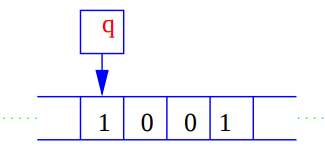
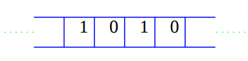
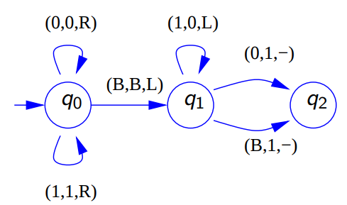
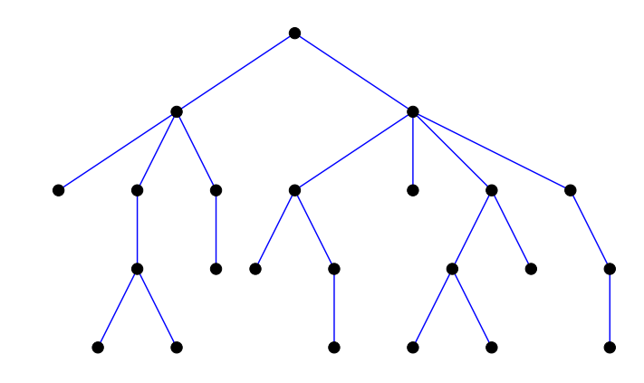
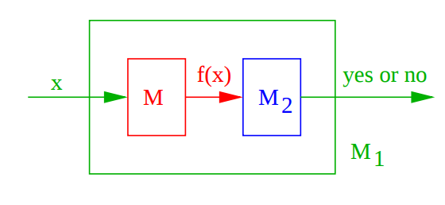

# NP Completeness

Yong Wen Chua

https://github.com/lawliet89/np-complete

<!-- Made with Marp: https://github.com/yhatt/marp -->

---
## Computation Complexity Theory

- More than Big Oh Notation
- Classifying computational problems according to their inherent difficulty into different _classes_
- Relation between the different _classes_

---
## Journey
1. Computation Resources
3. Decision Problems 
4. Modelling via Turing Machines
5. P
6. Non-determinism
7. NP
8. Reduction
9. NP-Complete
10. Example proof
11. P = NP?

---
## Computation Resources

- Time: Time taken by algorithm to solve. i.e. $\text{TIME}(f(n))$
- Space: Space needed to solve. Includes inputs, outputs, and intermediates. i.e.  $\text{SPACE}(f(n))$

---
### Hierarchy Theorem
- More space/time → Solve more (harder) problems.
- Intuitively, you need $f(n)$ time to be able to work with $f(n)$ space at least.
- But the reverse relation between space and time is less intuitive.

---
### Complexity Hierarchy


---
## Decision Problems


---

### Reachability

`RCH`: Given a directed graph `G` and nodes `x`, `y`, is there a path from `x` to `y`?

---
### Breadth First Search RCH Algorithm

Let `S` be a set of nodes to process. There are `n` nodes in the graph.
Initially, $S = \{x\}$.

At each stage, for some $z \in S$:
- remove `z` from `S`
- mark `z`
- Find all unmarked "successors" of `z` and add them to `S` 

Until `y` is found or `S` is empty.

Worst case: each edge is examined once. There are at most $n^2$ edges.
So $O(n^2)$.


--- 

### Decidable vs Undecidable

`RCH`: Decidable

`HALT`: Given the description of an *arbitrary* program and a finite input, decide whether the program finishes running or will run forever. 

This is undecidable.

---
### `HALT`
Assume an imaginary solver $H(p,x)$ which decides that if some program $p$ will halt for some input $x$. (i.e. a black box that solves `HALT`)

Then, we construct program `P`:

```
program P(y):
  if H(y,y) = halt then
    loop forever
  else:
    return
```

- If $H(P, P)$ = `halt` then $P(P)$ runs forever.
- If $H(P, P)$ = `loop` then $P(P)$ halts.

$H$ always gives the wrong answer. Generalized $H$ cannot exst.

---
### Tractable vs Intractable

- Tractable problems can be solved in a _feasible_ or _practical_ amount of time

Cook-Karp Thesis: Tractable = polynomial time ($P$) 

but... is $n^{100}$ or $2^{n/100}$ more practical?

---
## Deterministic Turing Machine (DTM)

- A model of computation used in reasoning about complexity.
- Read/Write head over a tape. Can move right or left. The head stores the current _state_ of the machine
- Symbols on tape
- A table of instructions where given the current state, and the symbol on the tape, decide whether to write to the tape, move left/right, or transition into a new state.

---
### Turing Machine - Binary Successor




State Machine:


---
### Further Modelling

- Use multiple tapes. 1-tape DTM is slower than a $k$-tape DTM by a polynomial factor.
- Random Access Machines (RAM): DTM is slower than RAM by $O(n^3)$.
- Multi tapes DTM are easy to reason. It's reasonable to use them to model computation.
---
### Invariance Thesis
(similar to Church-Turing Thesis)

All _reasonable_ sequential models of computation have the same time complexity as Deterministic Turing Machines (DTM) up to a polynomial.

e.g. RAMs, 1-tape DTM, $k$-tape DTM

---
## Problems

- A DTM gives a "yes" or "no" answer to a decision problem,
- It is **deciding** the problem.

e.g. A DTM $M$ decides that `2` is the next integer after `1`, but `0` is not.

If $M$ decides a size $n$ problem in $f(n)$ time, then

$$L\in \text{TIME}(f(n))$$

---
### (Formal) Languages
Formally, a language $L$ is a set of strings over a given alphabet $\Sigma$, where $B$ is the blank symbol.

Then let $L\subseteq(\Sigma-\{B\})^*$ and $M$ be a DTM with alphabet $\Sigma$ such that for any $w\in(\Sigma-\{B\})^*$:

- if $w\in L$ then $M(w)$ terminates with `yes`
- if $w \notin L$ then $M(w)$ terminates with `no`

Then we can say $M$ **decides** $L$ and $L$ is recursive because it is decided by some DTM.

Then iff for any length $n=|w|$ of $w\in(\Sigma-\{B\})^*$, $M$ operates within the time bound $f(n)$, we say 

$$L\in \text{TIME}(f(n))$$

---
## Polynomial Time (P)

$$P=\bigcup\limits_{k} TIME(n^k)$$

That is $P$ is the set of decision problems which can be decided by a DTM in polynomial time for all inputs.

---
### Known Problems in P

- Greatest Common Denominator (GCD)
- PRIMES - whether a number is prime (https://www.cse.iitk.ac.in/users/manindra/algebra/primality_v6.pdf)

---

## Determinism vs Non-Determinism

<small>For the same input, $f(n)$ is the time          taken to solve the input size $n$.</small>


Notation for non-deterministic runtime: $\text{NTIME}(f(n))$

---
## Non-deterministic Turing Machines (NDTM)

A NDTM $M$ has many possible computation for some input $w$ that is chosen at random.



$M(w)$ represents the tree, with some depth.

NDTM is not practical.

---
### NDTM Modelling

For the same input of size $n$ to a problem $L$, if over multiple runs of the NDTM $M$
- It might say "yes" sometimes
- It might say "no" sometimes
- But it must always terminate within time $f(n)$

Then $M$ decides $L$ and 
$$L\in \text{NTIME}(f(n))$$

---
### How is this useful?

- Easier to come up with a non-deterministic algorithm to some problem. (e.g. algorithm to "guess" a path from node `x` to `y`)
- Then we can try to simulate this with DTM.
- Define complexity classes with NDTM and their relationship with DTM complexity classes.

---
### Simulating a NDTM

- A NDTM can be simulated by a DTM for a problem of size $n$ in time $O(C^{f(n)})$ for some constant $C > 1$.

We don't know if the simulation can be improved. (i.e. We don't know if $P = NP$.)

---
### (Formal) Nondeterministic Acceptance and Time

For some language $L$, if $M$ returns `yes` on some input $w$, then we say $M$ accetps $L$. (i.e. it can reject, or never terminate).

A NDTM $M$ _operates within time_ $f(n)$ if $M(w)$ has depth $\leq f(|w|)$.

Then we can say NDTM $M$ _decides_ a language $L$ within time $f(n)$ if
- $M$ _operates within time_ $f(n)
- $M$ accepts $L$

$L\in NTIME(f(n))$ iff $L$ is decided by some NDTM operating within time $f(n)$.
$$L\in NTIME(f(n))$$

---
## Non-deterministic Polynomial Time (NP)

$$NP=\bigcup\limits_{k} NTIME(n^k)$$

That is $NP$ is the set of decision problems that can be decided by a NDTM in polynomial time for all inputs.

More usefully: you can "guess" a solution to a $NP$ problem in polynomial time and _verify_ that it is a solution in polynomial time.

---
### NP Problems

- All problems in $P$
- Integer factorization (most likely in NP)
- Graph Isomorphism: Given two graphs, is there a mapping of nodes from one graph to the other so that all the nodes still share the neighbours?
- `SAT`: Given a set of logic clauses with variables, is there an assignment of boolean values to the variables that will satisfy the clauses?
- Hamiltonian Path (`HP`): Given an undirected graph, is there a path visiting each node exactly once?
- Decision version of Travelling Salesman (`TSP(D)`): Is there a route visitng all cities with total distance less than some $k$?

---
## Reduction

- Algorithm to transform one problem into another
- If we transform $L_1$ to $L_2$, we write $L_1 \leq L_2$
- $L_2$ is at least as _hard_ as $L_1$
- If we can efficiently solve $L_2$, we can efficiently solve $L_1$.
- Karp reduction: this transformation algorithm must be in $P$.

---
### (Formal) Karp Reduction

$L_1$ is Karp reducible to $L_2$ ( $L_1 \leq L_2$) if there is a map $f$ such that
- $x\in L_1$ iff $f(x)\in L_2$ and
- $f$ is in $P$

Let $M_1$ decide $L_1$, $M_2$ decide $L_2$ and $M$ computer $f(x)$. Then



---
### Properties of Reduction

If $L_1 \leq L_2$
- if $L_2$ is in $P$, then $L_1$ in $P$
- if $L_2$ is in $NP$, then $L_1$ in $NP$
- $\leq$ is transitive

---
## NP-complete (NPC)

NP-hard: "at least as hard as the hardest problems in NP"

- $L$ is NP-hard if for some $L'$ in $NP$, $L' \leq L$ $\forall L \in NP$.

Then

$L$ is NP-complete if
- $L$ is in $NP$
- $L$ is NP-hard

That is NPC problems are the "hardest" in NP

---
### NPC Relation


---
### NPC Problems

- `SAT`: Proven by Cook-Levin Theorem
- [Karp's 21 NP-Complete problems](https://en.wikipedia.org/wiki/Karp%27s_21_NP-complete_problems)
- `TSP(D)`
- Knapsack problem: Can a value of at least $V$ be achieved without exceeding the weight $W$?
- `HP`
- K-Graph colouring

[Huge list of NPC problems](https://en.wikipedia.org/wiki/List_of_NP-complete_problems)

---
### NPC Reduction


---
## Prove that Vertex Cover is NP-Complete

`VERTEX COVER`: Given an undirected graph $G$, is there a set of vertices in $G$ smaller than some size $k$ such that all the edges in $G$ have at least one end in the set of vertices?

Strategy:
- Prove `VERTEX COVER` is in NP
- Reduce a known NP-Complete problem to `VERTEX COVER`

### Handwaving `VERTEX COVER` is in NP

- NP: Can guess a set of vertices and then check by examining at most $n^2$ edges.

---

### `3SAT`:

Consider a set of boolean variables, and a set of logical clauses where each clause has exactly three variables. Is there an assignment of values to the variables to satisfy the clauses?

One of [Karp's 21 NP-Complete problems]: Known NP-Complete problem

---
### Reduce `3SAT` to `VERTEX COVER`

Consider the clauses: $(A ∨ A ∨ B) ∧ (¬A ∨ ¬B ∨ ¬C) ∧ (¬A ∨ B ∨ C)$

- Nodes for each variable and its complement, joined by an edge
- A "triangle" of variable nodes for each clause
- Add edges between variables of themselves
- For $l$ variables with $m$ clauses, vertex cover of at most $l + 2m$


---
### Vertex Cover


Why $\leq l + 2m$ ?
- $l$: Either the true/false for each variable: covers the edges between them
- Also cover the edges between the variable and their counterparts in the "triangles"
- Then for each "triangle", at most 2 more edges to cover the internal edges and the edges between the "incorrect" variables and the triangles

---
### Solution to `3SAT`


The solution are the cover vertices that are part of the "variable pairs".

---
### Reduction Algorithm
- $2l + 3m$ nodes graph construction
- Can be done in P-time

Thus, `VERTEX COVER` is NP-complete.

---
## P = NP?

- P problems can be solved efficiently.
- NP problems have no known efficient algorithms to solve.

---
### Consequences in Public Key Cryptrography
- Depend on "difficulty" of problems like Discrete logarithm and integer factorization that are known to be neither in P nor NP-complete to create "one-way" functions.
- If $P=NP$, then we can find an effective solution to some NP-complete problem and reduce the rest to that problem to solve them.
- If $P \neq NP$ then we can show that one-way functions exist.

### Consequences in Operation
- If $P=NP$ Efficient solution to Integer Linear Programming (for optimization under constraints) and Travelling Salesman
