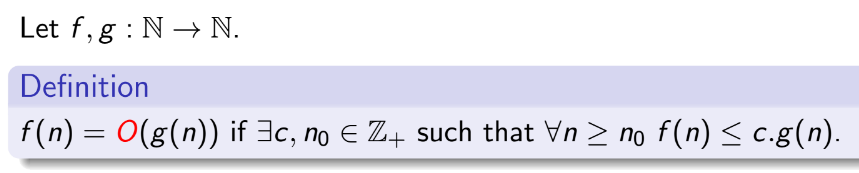

# NP Completeness

Yong Wen Chua

https://github.com/lawliet89/np-complete

<!-- Made with Marp: https://github.com/yhatt/marp -->

---
## Content
1. Decision Problems
2. What is the Computational complexity theory?
4. Turing Machine model of computation
5. Complexity Hierarchy
6. P Problems
7. NP Problems
8. NP-Hard and NP-Complete problems
9. Turing Reduction
10. P ≟ NP

---
## Decision Problems


---

### Reachability

`RCH`: Given a directed graph `G` and nodes `x`, `y`, is there a path from `x` to `y`?

---
### RCH Algorithm

Let `S` be a set of nodes to process. There are `n` nodes in the graph.
Initially, $S = \{x\}$.

At each stage, for some $z \in S$:
- remove `z` from `S`
- mark `z`
- Find all unmarked "successors" of `z` and add them to `S` 

Until `y` is found or `S` is empty.

Worst case: each edge is examined once. There are at most $n^2$ edges.
So $O(n^2)$.

---
### Big Oh Notation



_The time or space required is bounded by this function._

---
## Computation Complexity Theory

- More than Big Oh Notation
- Classifying computational problems according to their inherent difficulty into different _classes_
- Relation between the different _classes_

--- 

### Decidable vs Undecidable

`RCH`: Decidable

`HALT`: Given the description of an *arbitrary* program and a finite input, decide whether the program finishes running or will run forever. 

This is undecidable _over Turing Machines_.

<small>Proceedings of the London Mathematical Society, Volume s2-42, Issue 1, 1 January 1937, Pages 230–265, https://doi.org/10.1112/plms/s2-42.1.230</small>

---
### `HALT`
Consider an _Oracle_ $H(p,x)$ which decides that if some program $p$ will halt for some input $x$. (i.e. a black box that solves `HALT`)

Then, we construct program `P`:

```
program P(y):
  if H(y,y) = halt then
    loop forever
  else:
    return
```

- If $H(P, P)$ = `halt` then $P(P)$ runs forever.
- If $H(P, P)$ = `loop` then $P(P)$ halts.

$H$ always gives the wrong answer. Generalized $H$ cannot exst.

∎ Contradiction

---
### Tractable vs Intractable

- Tractable problems can be solved in a _feasible_ or _practical_ amount of time

Cook-Karp Thesis: Tractable = polynomial time ($P$) 

but... is $n^{100}$ or $2^{n/100}$ more practical?

---
## Turing Machines


